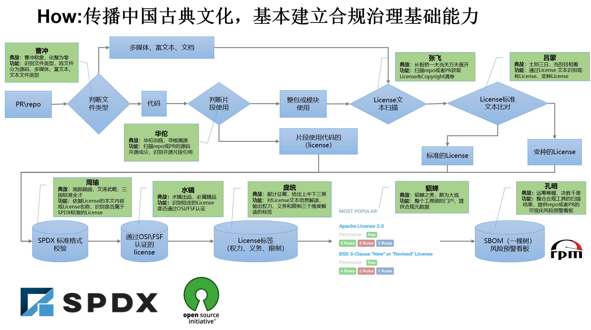

## This is the open source software compliance tool chain

1. [caochong](https://github.com/openComplianceCode/ComplianceToolChain/tree/main/caochong)：Identify file types and classify files into source code, multimedia, rich text, and text file types.

2. [lvbu](https://github.com/openComplianceCode/ComplianceToolChain/tree/main/lvbu)：Identify compatibility between given two Licenses

3. [lvmeng](https://github.com/openComplianceCode/ComplianceToolChain/tree/main/lvmeng)：Identify existing licenses and variant licenses through license text

4. [zhangfei](https://github.com/openComplianceCode/ComplianceToolChain/tree/main/zhangfei)：Scan the repo or PR to obtain the License&Copyright list

5. [diaochan](https://github.com/openComplianceCode/diaochan)：Portal for the entire tool chain, providing compliance metadata